# Unit A

This unit explores the navigation mechanics of a robot equipped with a 2D LIDAR scanner and two wheel encoders. Each wheel encoder counts the rotations of its respective wheel in ticks, which translate to a specific distance that the robot travels.

`NOTE: Differences in wheel rotation speeds cause the robot to turn.`

## Representing Robot Motion
The robot's movement can be categorized into two primary types:
1. Circular movement
2. Straight movement

To estimate the new position of the robot after moving, we calculate the distance using:

`distance = motor_ticks * ticks_to_distance_ratio`

`This ratio is calculated by moving the robot a known distance and then dividing the number of ticks by this distance.`

### Circular Movement

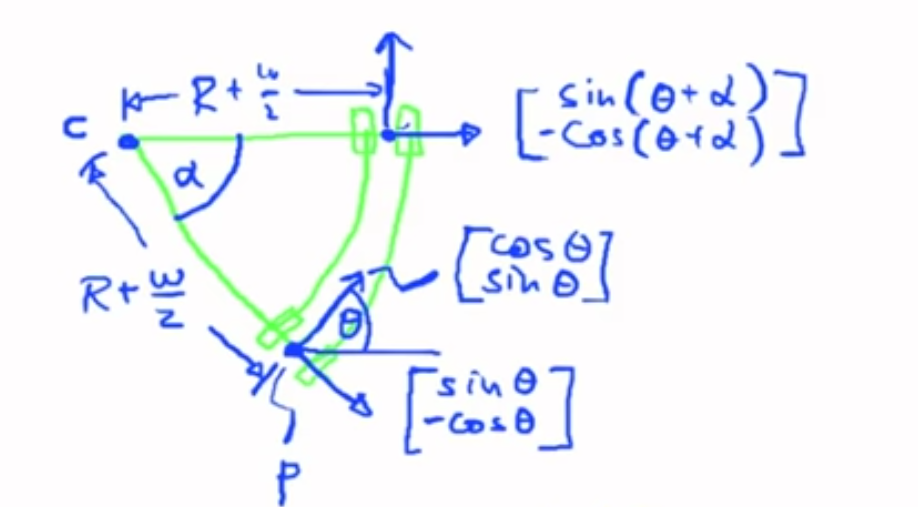

Details:
* **c** is the pivot center around which the robot rotates.
* **R** is the circular path's radius.
* **w** represents the robot's width.
* **theta** is the heading angle.
* **p** marks the midpoint of the robot's width.
* **alpha** is the angle through which the robot turns.

Using the arc length formula, we compute the radius of the robot's path. The difference in ticks between the two wheel encoders helps us determine the rotation angle:

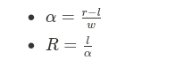

We then find the pivot point's coordinates:

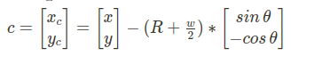

And calculate the robot's new position:

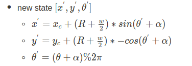

---
### Straight Movement

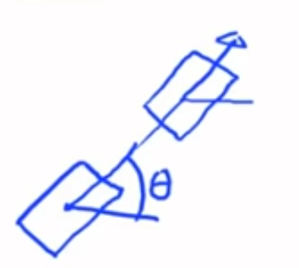

When both wheels move equally, indicating no turns, the new position is straightforward:

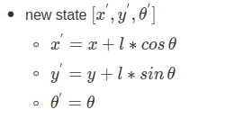

---
## Scanner Data

At this point we still don't have a good trajectory of the robot

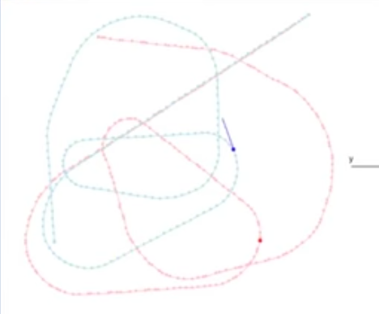

The actual trajectory of the robot is the red dotted trajectory while the green one is the computed trajectory using motor ticks. It is not sufficient to use only the motor ticks, we need to use scanner data to correct the trajectory. This is done by calculating the detected cylinders position and assign them to the nearest possible landmark in the given map. But first let's understand how the cylinders are detected.

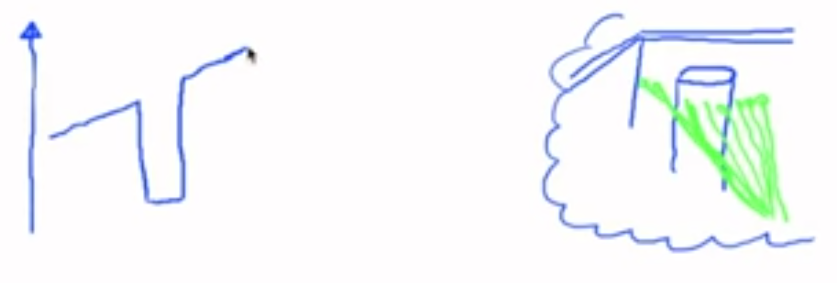

When the robot detects a sharp decrease (high -ve derivative) in distance from one measurement to the next, it considers this as a potential starting point of a cylindrical object. This suggests that the robot has encountered the near edge of a cylinder. As the robot continues to take measurements, it tracks this potential cylinder. If the subsequent measurements indicate stable or consistent distances that are greater than a minimum threshold, it implies the side of a cylinder.

If there is a sharp increase (high +ve derivative) in distance after a series of consistent measurements, the robot considers this as the end of the cylinder. This transition signifies that the robot has passed the cylinder, moving from the body of the cylinder back to open space.

Throughout this process, if the conditions of beginning, continuation, and end of a cylinder are met, the robot calculates the average position of these measurements to determine the central axis of the cylinder.

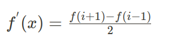

but due to measurement errors we need to set a threshold to derivatives that will be considered as a left/right edge of a cylinder BUT there might be a situation where the laser scans hit two cylinders with no gap which will result in two consecutive left edges (or right edges) as follows:

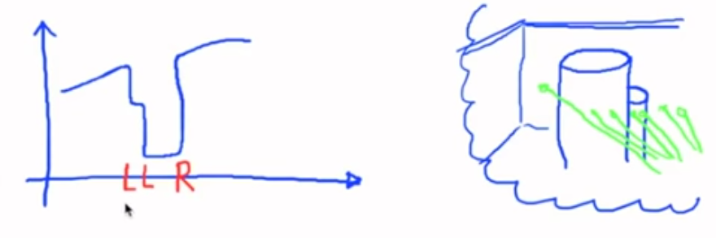

In situations where two cylinders are positioned directly behind one another, it can be challenging for a robot to accurately detect the end of the first cylinder. This difficulty arises because the robot might not observe a significant change in distance, which usually marks the boundary between objects. As the second cylinder begins right where the first one ends, the distance measured by the robot remains consistent, appearing as though the first cylinder simply continues.

To address this issue, a practical solution has been implemented: the robot is programmed to disregard the first negative derivative (a mathematical representation of a decrease in distance) it encounters. Instead, it considers the start of the cylinder from the point marked by the second negative derivative. This approach helps in more accurately determining where one cylinder ends and the next begins, ensuring more reliable object detection by the robot.

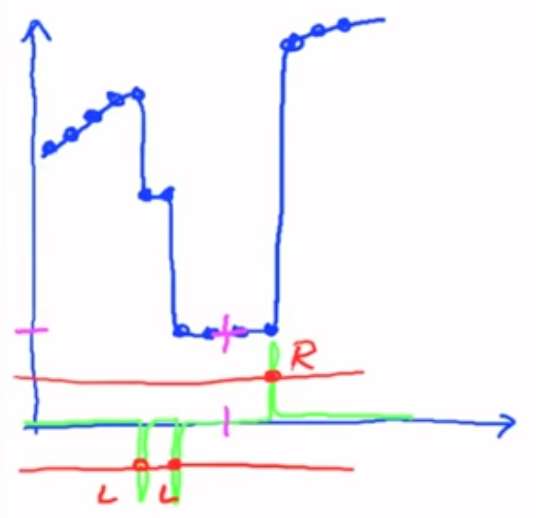

## Final Result

After going through all these steps we end up with this trajectory (that could be improved) of our robot as follows:

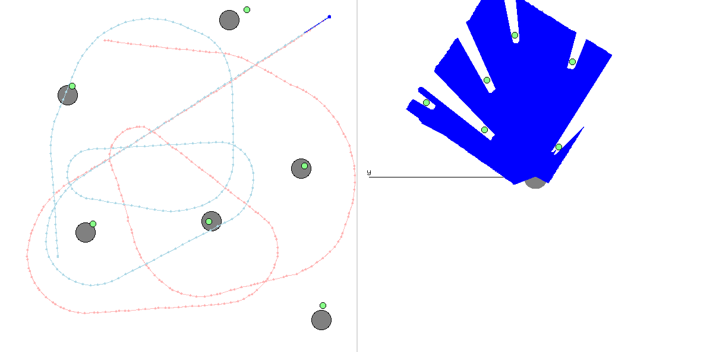

## Code Overview

- The first Python file, `1plot_motor_ticks.py`, includes a script for plotting motor tick values from a robotics data file. It reads motor values from a file named robot4_motors.txt, extracts left and right motor tick values, and then plots them on a graph to visualize the motor activities over time.

- The second Python file, `2plot_motor_increments.py`, reads and plots motor tick data from a file using a module called lego_robot. The script plots the motor ticks data, allowing visualization of how motor increments change over time.

- The third Python file, `3filter_motor.py`, implements a function called filter_step to compute the new position and orientation of a robot based on motor tick readings. This script uses trigonometry to determine movement and turning, accommodating both straight and curved paths based on differences in motor ticks. It processes a sequence of motor ticks from a log file (robot4_motors.txt), computes successive robot poses, and visualizes the path of the robot as a plot.

- The fourth Python file, `4filter_motor_file.py`, enhances the robot positioning logic found in the previous script by considering the displacement of a scanner from the robot's center. It processes motor tick data to update the robot's pose considering the scanner's offset, which is critical for accuracy in applications like mapping and navigation where the sensor's position relative to the robot's center impacts data interpretation. This script calculates both straight-line and turning movements, updates the robot's orientation, and recalculates the scanner's position after movement. The updated poses are plotted and saved to a file, `4poses_from_ticks.txt`, for further analysis or use.

- The fifth Python file, `5plot_scan_data.py`, visualizes scan data from a robotics system, specifically plotting the data from one scan. It uses the LegoLogfile class to read scan data from a file named `robot4_scan.txt`. This script focuses on displaying how the scan data is distributed across different angles, which can be essential for understanding sensor coverage or detecting anomalies in sensor readings.

- The sixth Python file, `6scan_derivative.py`, computes and visualizes the derivative of scan data from a robotic sensor. This script is particularly useful for identifying sharp changes in the scan data, which can indicate edges or objects within the robot's environment. It uses a central difference method to calculate the derivative, considering only points that exceed a minimum valid distance to avoid noise and irrelevant fluctuations. The results, including both the original scan and its derivative, are plotted for visual comparison, enhancing the ability to detect significant features in the scan data.

- The seventh Python file, `7find_cylinders.py`, implements a method to detect cylindrical objects from scan data, leveraging derivatives calculated from the scan to pinpoint significant changes in distance that might indicate the presence of an object. The process involves:

1. Computing the derivative of the scan data to find jumps, which are sudden changes in distance measurements.
2. Identifying regions between these jumps as potential cylinders.
3. Calculating the average position and depth for detected cylinders to provide a concise representation of each detected object.

The results are visualized with the original scan data and markers indicating detected cylinders, which is useful for robotic applications like obstacle avoidance or environment mapping.

- The last Python file, `8cylinder_cartesian.py`, extends the cylinder detection functionality by converting the cylindrical coordinates (based on scan data) to Cartesian coordinates. This is useful for mapping and robotics applications where real-world coordinates are required. The steps in the script include:

1. Computing derivatives of scan data to identify significant changes, indicating potential edges of objects.
2. Finding cylinders based on these derivatives.
3. Converting cylindrical coordinates of detected objects into Cartesian coordinates using trigonometric transformations, taking into account an offset that represents the physical displacement of the scanner from the robot's center.

The converted coordinates are written to an output file, 8cylinders.txt, which can be used for further processing or visualization in a more spatially relevant format.